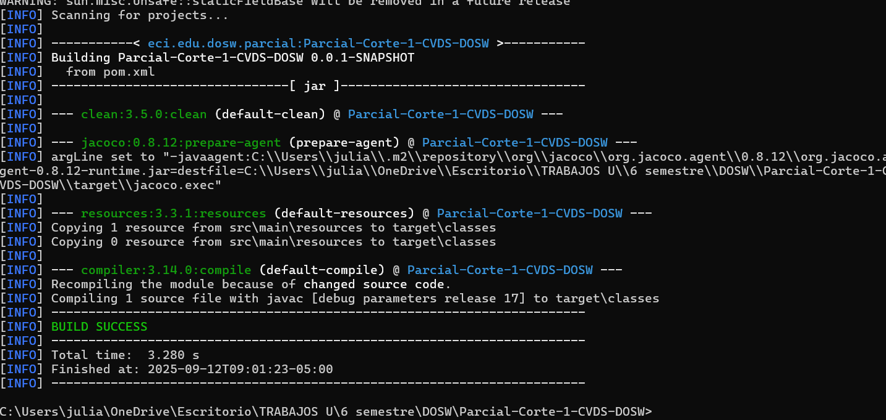
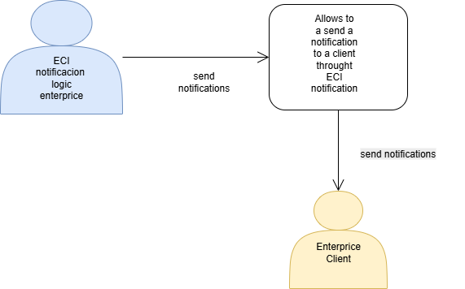
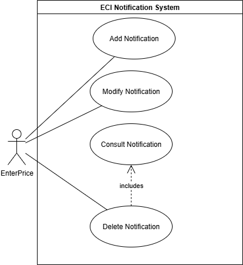
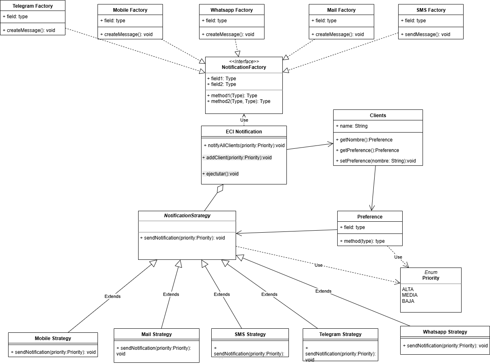
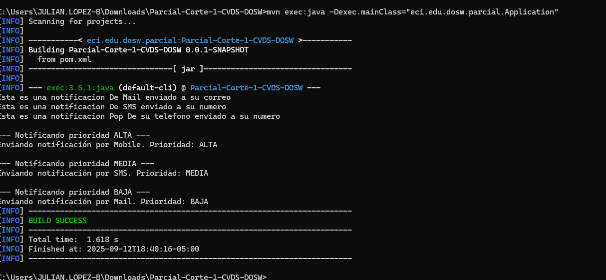
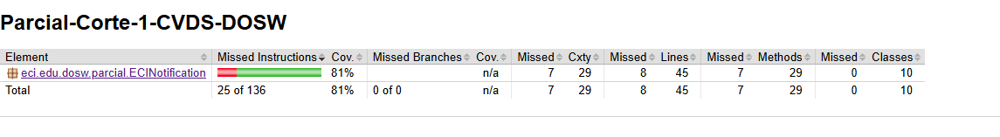
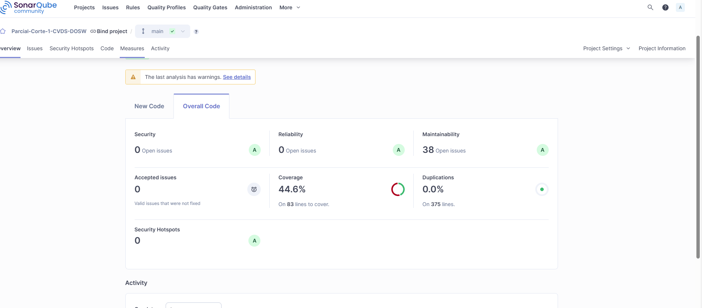

# Parcial-Corte-1-CVDS-DOSW

# Evidencia

## Diagrama De Contexto

### Diagrama Casos De Uso

### Principios SOLID usados 
- Se podria decir que se usan todos los principios debido a que cada clase u objeto maneja su propia responsabilidad, esta abierto a la extension con las interfaces implementadas y como lo dicen los otros principios con el uso de las interfaces lo podemos evidenciar

## Patrones Utilizados
### Patron 1
- Strategy
- El tipo de Strategy es de Comportamiento
- Se uso Strategy porque el enunciado nos menciona que la logica tiene que estar encapsulada en cada canal de notificaciones por lo tanto en base a la definicion de strategy cumple con esto , se refleja en el diagrama de clases en la interfaz que se tiene de NotificationStrategy con sus respectivos canales donde se realizara la logica de estos.

### Patron 2
- Factory Method
- Tipo del patron creacional 
- Se uso factory por la parte del enunciado que nos dice que se tienen que crear los tipos de notificacion dinamicamente y lo que hace este patron por definicion es que nos permite crear objetos en subclases en base a su superclase en el diagrama se puede observar con la superclase mensaje que sera la base y los diferemtes tipos que se piden seras las subclases

### Diagrama De Clases

### Uso Ejectutar

### Implementacion Jacoco

### Implementacion Sonar

### Pasos para ejecucion
- Podemos ejecutarlo con los comandos `mvn clean compile` y luego `mvn exec:java -Dexec.mainClass="edu.dosw.taller.Application"` 
- Para correr las pruebas con mvn y jacoco implementamos el comando `mvn clean test` o lo podemos hacer de a pasos primero compilando con mvn clean compile y luego con mvn test luego en la carpeta de jacoco/target/site podemos encontrar un archivo llamado index donde vemos el reporte

- Se descarga la imagen de docker con `docker pull sonarqube` luego arrancamos el servicio con `docker run -d --name sonarqube -e SONAR_ES_BOOTSTRAP_CHECKS_DISABLE=true -p 9000:9000 sonarqube:latest` creamos el toquen en la pagina de sonar y en nuestro directorio creamos un archivo que se llame sonar-project-properties y añadimos las siguientes propiedades y despues ejecutamos `mvn verify sonar:sonar -D sonar.token=[TOKEN_GENERADO]` y vemos el reporte en la web
