# Taller-Evaluativo-DOSW-PrimerCorte
Taller Evaluativo Desarrollo y Operaciones De Software

### Patrón Implementado 
- Se implemento el patron OBSERVER porque en base a la acción que se tome con los productos debe haber un agente que en base a estos comportamientos decida que hacer y segun la definicion “ un observer es un patron que permite un mecanismo para notificar a varios objetos sobre cualquier evento que se este observando”

### Diagrama De Contexto 
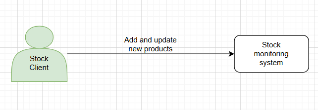
---
### Diagrama De Clases 
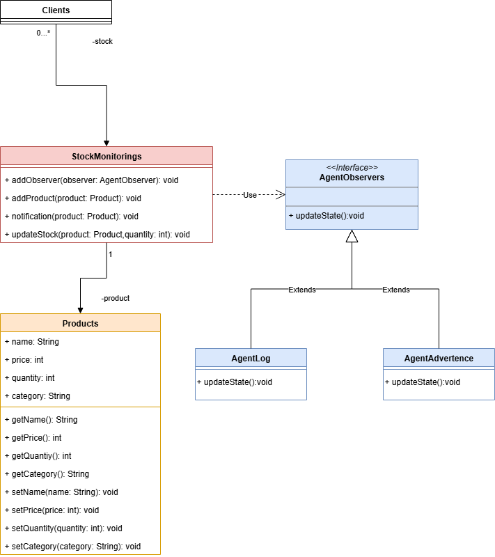

---
### Diagrama De Casos De Uso
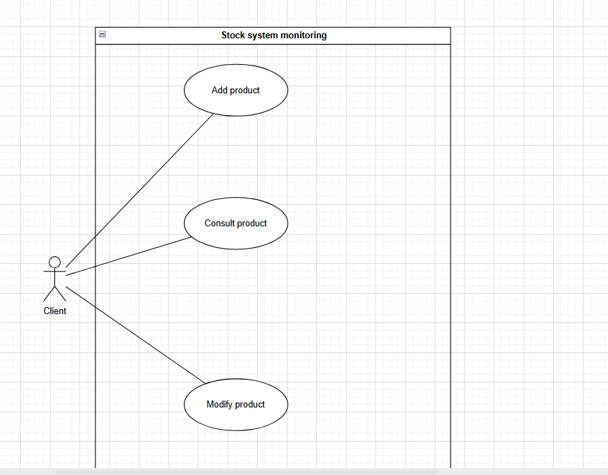
---

### Epicas: 
- El cliente desea un sistema de monitoreo de stock de productos, el cual le permita agregar productos nuevos y actualizar la cantidad de productos disponibles.
### Features:
- Implementar agente log
- Implementar agente advertencia
- Implementar stocks
### Historias de usuario:
- Como cliente quiero añadir un product al stock para poder tener un stock más grande
- Como cliente quiero consultar un producto para poder ver la cantidad de productos disponibles
- Como cliente quiero modificar un producto para poder actualizer los productos disponibles
- Como agente quiero consultar un producto para saber la funcionalidad voy a tener

### Plugins Implementados para Jacoco y Sonar
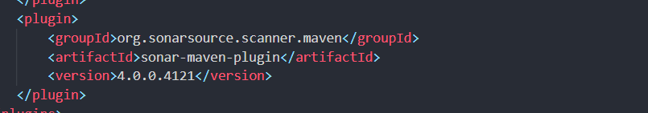
---
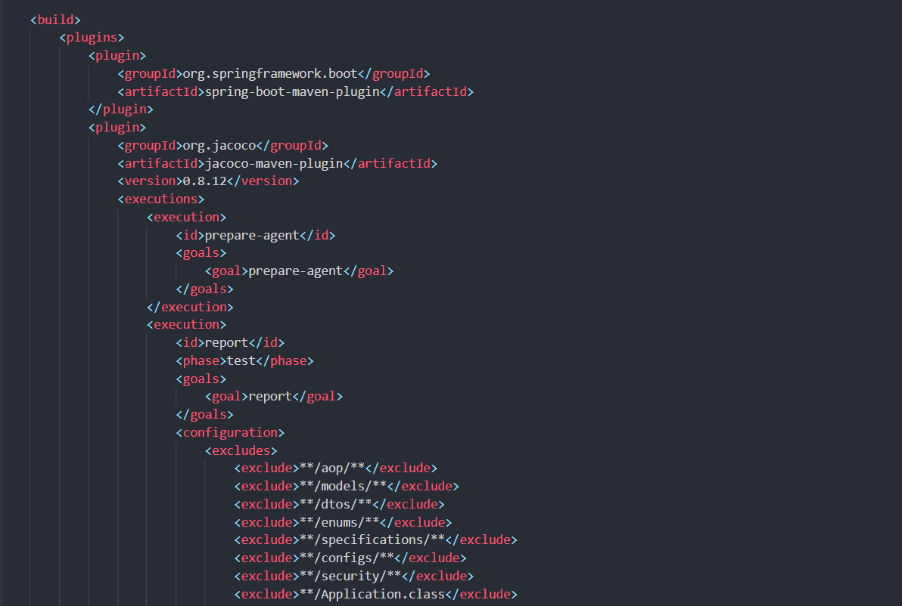
---
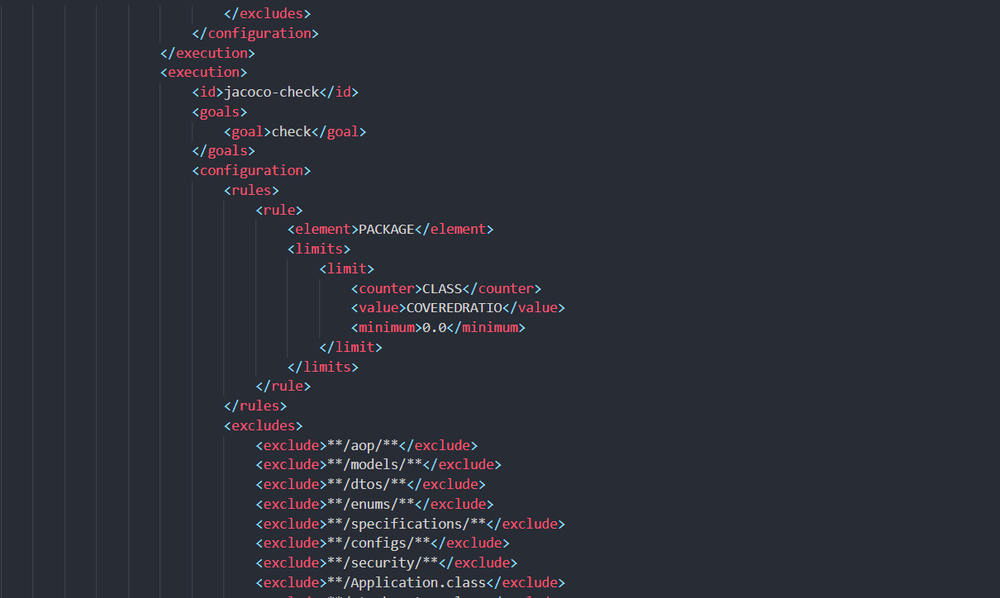

### Resultado Esperado Del Monitoreo De Stocks
- Podemos correrlo directamente desde la consola de nuestro editor 
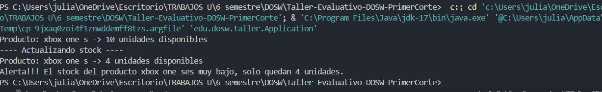
---
- O podemos ejecutarlo con los comandos `mvn clean compile` y luego `mvn exec:java -Dexec.mainClass="edu.dosw.taller.Application"` se podra ver de la siguiente forma.
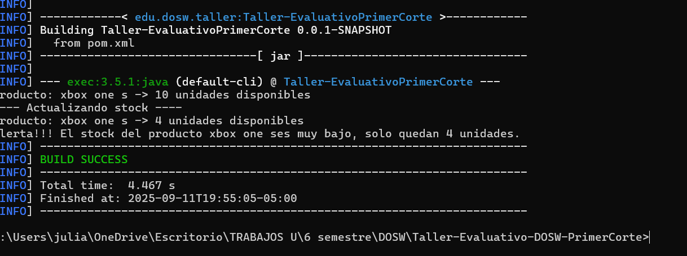
---
### Implementacion Pruebas Jacoco
- Para correr las pruebas con mvn y jacoco implementamos el comando `mvn clean test` o lo podemos hacer de a pasos primero compilando con `mvn clean compile` y luego con `mvn test` luego en la carpeta de `jacoco/target/site` podemos encontrar un archivo llamado index donde vemos el reporte
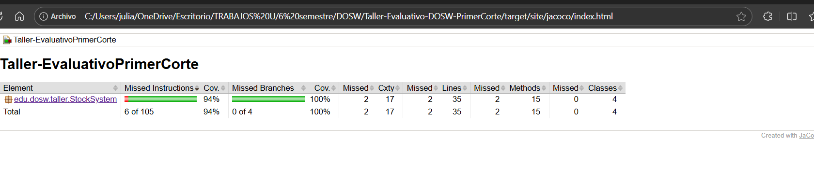
---
### Implementacion SonarQube
- Se descarga la imagen de docker con `docker pull sonarqube` luego arrancamos el servicio con `docker run -d --name sonarqube -e SONAR_ES_BOOTSTRAP_CHECKS_DISABLE=true -p 9000:9000 sonarqube:latest` creamos el toquen en la pagina de sonar y en nuestro directorio creamos un archivo que se llame `sonar-project-properties` y añadimos las siguientes propiedades y despues ejecutamos `mvn verify sonar:sonar -D sonar.token=[TOKEN_GENERADO]` y vemos el reporte en la web

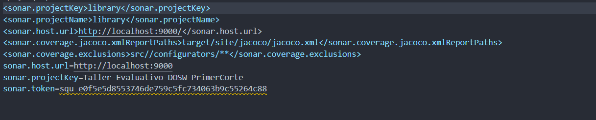
---
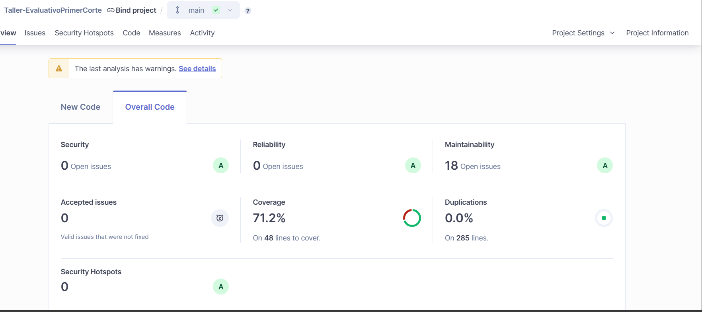

